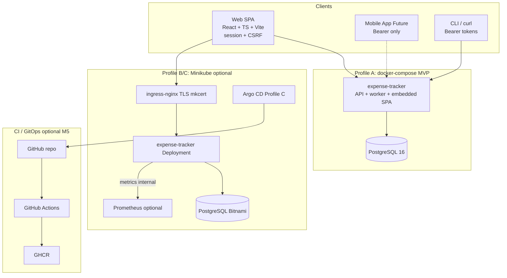
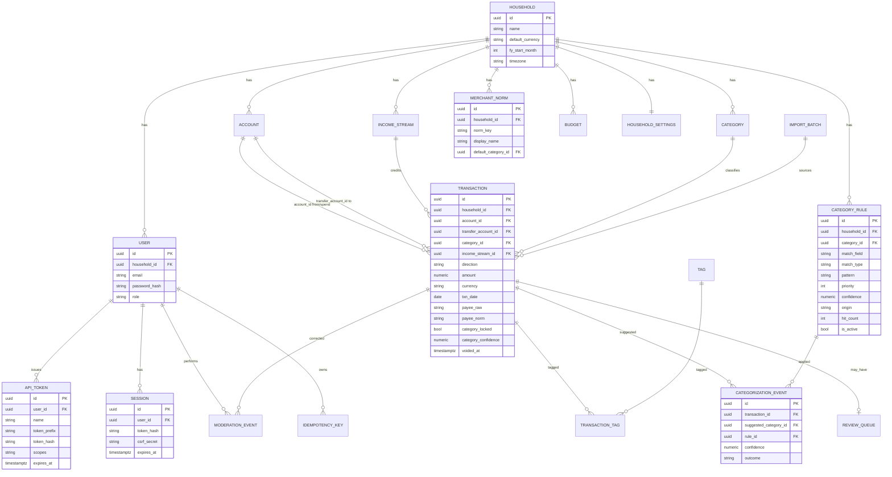
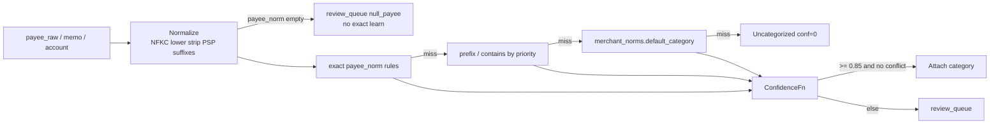
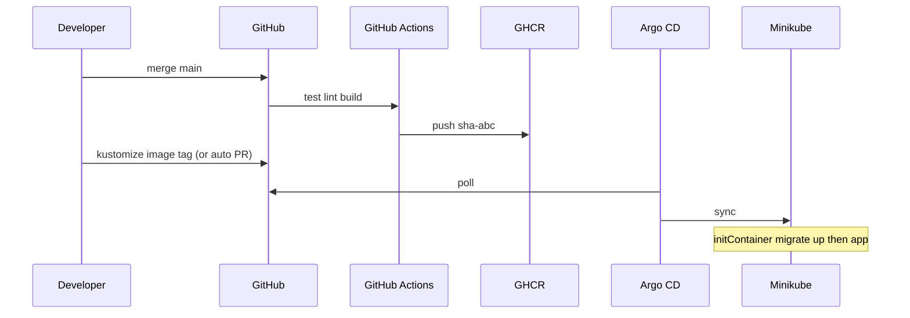

# Expense Tracker — System Design Document

| Field | Value |
| --- | --- |
| **Title** | Expense Tracker: Personal Finance Platform (Go, API-first, Minikube/GitOps) |
| **Author** | Engineering design draft |
| **Date** | 2026-06-27 |
| **Status** | Draft (revision 3 — re-review errata addressed) |
| **Repository** | `/Users/krishnamadhavan/Documents/xAI/expense-tracker` |
| **Git remote** | `https://github.com/krishnamadhavan/expense-tracker.git` (verified) |
| **Go module** | `github.com/krishnamadhavan/expense-tracker` |
| **Audience** | Senior engineers implementing and operating a single-household personal finance app |
| **Primary locale** | India (INR, UPI, FY Apr–Mar) with explicit extensibility |
| **License (default)** | MIT (add `LICENSE` in PR01; change only if owner prefers) |

---

## Overview

This document specifies a **greenfield personal finance web application** written primarily in **Go**, designed to track **expenses vs income** across payment channels (UPI, debit card, credit card, and extensible others) and income streams (PayCheck, Business Income, Rental Income, and extensible others). The system prioritizes **period-end review** — monthly and Indian Financial Year (FY Apr–Mar) reports and charts — and an **automatic categorization** pipeline in which the user is a **moderator** and the system **learns from corrections** so repeated edits diminish over time.

The architecture is **API-first** so a mobile client can share the same backend later. Deployment targets **local-first** development (`docker-compose` for daily work) with an optional path to **Minikube** and **GitOps (Argo CD)** so a later move to cloud Kubernetes is a configuration promotion, not a rewrite. All core dependencies are **open-source**. The repository is currently empty aside from `README.md` and a Go-oriented `.gitignore` (commit `e11b8e7` on `main`); this design is the implementation blueprint.

**MVP definition of done (solo developer) — single source of truth:**

| Tier | What “done” means | Runtime | PR cut line |
| --- | --- | --- | --- |
| **MVP-functional** | Secure API + hybrid categorization/learning + SPA transactions + review queue | **`make run`** (or air) against local/CI Postgres **or** **minimal Profile A compose** (`db` + `migrate` + `api`) from **PR05** — SPA via **Vite dev** (`web/`) against that API | **PR01–PR11** (PR12 charts optional but recommended) |
| **MVP-packaged (Profile A complete)** | Same product, **one-command** `docker compose up` serves **API + embedded SPA** | Full Profile A: multi-stage image + `embed.FS` | **PR01–PR11 + PR13** |

**Official “usable on docker-compose as Profile A” claim requires PR13.** Day-to-day until then uses PR05 minimal compose + Vite (or `make run`). Reports APIs (PR08–09) and chart UI (PR12) are high-value and should land before or with packaging when possible. Full Minikube/Argo/GHCR (Profile B/C) is **M5 stretch** — not required for MVP-functional or MVP-packaged.

---

## Background & Motivation

### Current state

- Single initial commit on `main` (`e11b8e7 Initial commit`) with `README.md` (`# expense-tracker`) and standard Go `.gitignore`.
- Remote: `origin` → `https://github.com/krishnamadhavan/expense-tracker.git` (GitHub; CI via GitHub Actions is valid).
- No application code, schemas, manifests, or CI yet.

### Pain points this system addresses

1. **Fragmented money movement**: Indian households typically split spend across UPI, debit, credit, cash, and wallets; income arrives via salary, business, rent, etc. Spreadsheets do not scale to multi-channel reconciliation and FY close.
2. **Manual categorization fatigue**: Recurring merchants (e.g. `swiggy*`, UPI VPAs) are re-tagged every month unless the system learns from prior moderations.
3. **Period-end blindness**: Without structured monthly P&L and FY YTD views, overspend and income composition are discovered late.
4. **Client lock-in risk**: A UI-only monolith blocks a future mobile app; an API-first core avoids that trap.
5. **Local-first privacy with portable ops**: Financial data should not depend on third-party SaaS for core storage, but the **ops model** can optionally mirror production K8s (GitOps, migrations, backups) so cloud migration is incremental.

### Design posture

**Enterprise-grade patterns, household-scale load.** Prefer boring, well-understood components (Go HTTP API, PostgreSQL, optional Argo CD, Helm/Kustomize) over novel infrastructure. Optimize for **clarity of domain model**, **safe migrations**, and **observable categorization learning**, not multi-tenant SaaS scale. Prefer **decisive defaults** over open questions that block PR03 schema work.

---

## Goals & Non-Goals

### Goals (v1 and near-term)

| ID | Goal |
| --- | --- |
| G1 | Track income and expenses with payment methods and income streams as first-class concepts. Accounts are **payment-channel tags**, not a full balance sheet in v1 (see KD19, NG10). |
| G2 | API-first REST backend in Go with OpenAPI 3.1 contract; web UI is a client, not the source of truth for authorization or business rules. |
| G3 | Hybrid auto-categorization (rules + learning from moderations) with confidence scores and a review queue. |
| G4 | Monthly and FY (Apr–Mar default, configurable) reports with chart-ready JSON series APIs. |
| G5 | **Optional** deploy to Minikube with GitOps (Argo CD) and CI-built images; **required** path is docker-compose for MVP (see Platform profiles). |
| G6 | Single-user / single-household auth that evolves to passkeys; API tokens for mobile/CLI from day one. |
| G7 | PostgreSQL persistence with versioned migrations and a documented backup story (RPO ≤ 24h on local profile). |
| G8 | Incremental PR plan that delivers value early: **DB + API → categorization → reports APIs → UI → GitOps hardening (optional)**. |

### Non-goals (v1)

| ID | Non-goal | Rationale |
| --- | --- | --- |
| NG1 | Multi-tenant SaaS / multi-household on one deployment | Single-user local; schema still **household-scoped** for future safety (KD25). |
| NG2 | Live bank Open Banking / Account Aggregator feeds | Design **import hooks** only. |
| NG3 | Tax filing, ITR generation, GST | Adjacent domain. |
| NG4 | Investment / portfolio tracking | Out of scope. |
| NG5 | Multi-currency FX trading P&L | INR primary; `currency` column only. |
| NG6 | Real-time collaborative multi-user editing | One principal. |
| NG7 | Production multi-region HA | Local only. |
| NG8 | ML model training pipeline / GPU inference | Rules + learning; ML behind interface later. |
| NG9 | Deep mobile app implementation | API contract + tokens only. |
| NG10 | **Account balances / balance sheet / liability ledgers** | v1 does **not** compute or store running balances. Accounts classify *how* money moved. Credit cards are spend channels only (KD20). Optional derived channel totals on reports are not “balances owed.” |
| NG11 | **Regex category rules** | v1 supports `exact`, `prefix`, `contains` only (ReDoS avoidance). Regex = v1.1. |
| NG12 | **Hard multi-region backup / cloud DR** | Local RPO/RTO only (see Operability). |

---

## Key Decisions

| # | Decision | Choice | Rationale |
| --- | --- | --- | --- |
| KD1 | Backend language | **Go 1.24.x** pinned exactly in `go.mod` (`go 1.24.0` or latest 1.24 patch available at PR01) and CI `setup-go` | Static binary, K8s-friendly; pin avoids toolchain drift. |
| KD2 | Architecture style | **Modular monolith + clean/hexagonal boundaries** | Single deployable; testable packages. |
| KD3 | API style | **REST + OpenAPI 3.1**, `/api/v1/...`; **breaking changes → `/api/v2`** | Mobile + web; versioning policy explicit. |
| KD4 | Web UI | **SPA React + TypeScript + Vite**; charts via **Recharts** (KD26) | Chart-heavy UX; does not block mobile. |
| KD5 | Database | **PostgreSQL 16** | K8s/cloud path fidelity; JSONB; concurrent writers. |
| KD6 | Migrations | **golang-migrate** v4.x, SQL files under `migrations/`; **initContainer-only** for migrate-up in K8s | No race with multi-replica later; app assumes schema ready. |
| KD7 | Categorization v1 | **Hybrid rules + learned exact payee rules**; confidence + review queue | Explainable; learns from moderations. |
| KD8 | Auth phase 1 | Argon2id password + **cookie sessions (web)** + **Bearer opaque tokens (mobile/CLI)**; **CSRF** for cookie mutations (KD27) | Dual client matrix. Passkeys phase 2. |
| KD9 | GitOps | **Argo CD** — **Profile C optional** | Great for learning K8s; not MVP-blocking. |
| KD10 | Manifest packaging | **Kustomize** base + overlays; Helm for third-party only | Simple app YAML. |
| KD11 | CI | **GitHub Actions** (remote is GitHub — verified) | Matches `origin`. |
| KD12 | Image registry | **GHCR** `ghcr.io/krishnamadhavan/expense-tracker`; offline: `minikube image load` | Owner path locked. |
| KD13 | Secrets | **SOPS + age**; operator keeps **primary + backup** age keys (offline copy) | Laptop SPOF mitigated by backup key ceremony. |
| KD14 | Ingress | **ingress-nginx** on Minikube (Profile B+) | Standard addon. |
| KD15 | Currency & FY | **INR**; amounts **`NUMERIC(19,2)`**; FY start **April**; TZ **`Asia/Kolkata`** defaults on household | India-primary; 2 dp sufficient for INR; 4 dp rejected as unnecessary. |
| KD16 | Background work | **In-process worker** in same process as API; `replicas: 1` | No extra infra. Recategorize job respects learning (see Categorization). |
| KD17 | Observability | **slog JSON** + Prometheus `/metrics` on **internal-only** bind or auth in K8s; core counters from **PR06–PR07** | Lite; scrape optional Profile B+ (PR18). |
| KD18 | Module path | **`github.com/krishnamadhavan/expense-tracker`** | Matches verified `git remote`. |
| KD19 | **Transfers** | **Single-row transfer**: `direction=transfer`, `account_id` = **from**, `transfer_account_id` = **to** (required when direction=transfer). Amount ≥ 0. **Excluded from income/expense P&L aggregates.** No linked pair / double-entry table in v1. | Implementable; models UPI→CC bill, bank→cash without balance ledger (NG10). |
| KD20 | **Credit cards** | **`account.type=credit_card` spend channel only** — no liability balance, due date, or minimum-due fields in v1 schema. | Avoids half-baked ledgers; CC payments recorded as transfers from bank/UPI → CC account. |
| KD21 | **SPA delivery (local/MVP)** | **Embed `web/dist` in Go binary** via `embed.FS`; SPA fallback `index.html` for client routes | One process for compose/Minikube simplicity. |
| KD22 | **PostgreSQL on Minikube** | **Bitnami PostgreSQL Helm chart** pinned by version for Profile B; CNPG deferred to cloud-hardening note | Fastest first success; pin charts/images. |
| KD23 | **Amount type** | **`NUMERIC(19,2)`** everywhere money is stored; display uses household `locale` for grouping | INR 2 dp; avoids float. |
| KD24 | **HTTP router** | **`go-chi/chi/v5`** | Middleware ergonomics; one choice (not stdlib dual-track). |
| KD25 | **Household isolation** | Every query/command scopes by **`household_id` from authenticated principal** via `RequireHousehold(ctx)` — even with one household | Prevents accidental global scans; future multi-household without rewrite. |
| KD26 | **Chart library** | **Recharts** | React-native integration; one choice. |
| KD27 | **CSRF (cookie SPA)** | **Session is authority; cookie is delivery.** On login, server stores `sessions.csrf_secret` and sets non-HttpOnly cookie `csrf_token` to the **same value**. Mutating requests must send `X-CSRF-Token` equal to **`session.csrf_secret`** (middleware loads session; compares header to DB/session store — **not** “header equals cookie” alone). SPA may read `document.cookie` **or** `GET /api/v1/auth/csrf` (returns `{ "csrf_token": "..." }`). Bearer-only requests **exempt**. | Prevents classic double-submit without server bind; one source of truth. |
| KD28 | **Cookie Secure flag** | Default **`ET_COOKIE_SECURE=true`** with **TLS via mkcert** on Minikube/compose HTTPS; set **`ET_COOKIE_SECURE=false` only** for explicit local HTTP with logged warning. Prefer HTTPS even locally. | Avoids “Secure cookie never set on HTTP” footgun. |
| KD29 | **Transaction mutations** | Prefer **`voided_at`** soft-void over hard DELETE for financial rows; `DELETE` API maps to void in v1 | Audit-friendly. |
| KD30 | **Auth tables in PR03** | **users, sessions, api_tokens** ship in initial migration with domain tables | No split-brain PR03 vs PR06. |
| KD31 | **MVP platform profile** | **Profile A** is the MVP *target* runtime. **Minimal compose** (`db`+`migrate`+`api`, no SPA embed) ships in **PR05** for MVP-functional. **PR13** completes Profile A (multi-stage image + embedded SPA) for **MVP-packaged**. Profile B/C optional stretch. Until PR05, `make run` + Postgres is valid. | Solo laptop realism; removes “MVP needs compose but compose is M5-only” contradiction. |
| KD32 | **Report snapshots** | **Not required** for correctness; on-demand SQL aggregates only in v1 | Household scale. |
| KD33 | **Bootstrap** | First user via **`ET_BOOTSTRAP_PASSWORD`** (and optional email) **only if `users` count = 0**; endpoint/env ignored after; no interactive multi-step wizard in v1 | Simple, one-shot. |
| KD34 | **Idempotency** | **`Idempotency-Key`** header required support on `POST /api/v1/transactions` (and imports later); store hash per user | Mobile flaky networks. |
| KD35 | **API tokens** | Default TTL **90 days**; scopes **`read` \| `write`** in schema; UI issues `write` by default; hashed at rest (SHA-256 of secret); prefix for display (`et_live_…`) | Mobile-ready without refresh tokens in v1; revoke = delete row. |
| KD36 | **Error envelope** | **Mandatory** JSON shape (not optional RFC 7807 dual); OpenAPI documents it; CI spectral/lint in PR05 | One client contract. |
| KD37 | **Tags** | **v1: `tags: string[]` on transaction create/patch only** (upsert tag rows by name within household, link M2M). **No `/tags` CRUD routes** in v1 OpenAPI (tag admin REST = v1.1). M2M tables **`tags` + `transaction_tags` still in PR03**. | Single choice; avoids scope creep while keeping schema ready. |
| KD38 | **DB roles** | App connects as **`expense_app`** least-privilege role (DML on app tables); migrations use **`expense_migrate`** / owner | Not superuser in app DSN. |
| KD39 | **Migrations in K8s** | **initContainer** runs `migrate up`; app container does not | Clear ownership. |
| KD40 | **Backup RPO** | Local Profile A/B: **RPO ≈ 24h** (daily `pg_dump`); **RTO** best-effort restore drill (&lt; 1h target if backup exists) | Honest laptop DR. |

---

## Decisions locked for v1 (checklist)

Use this to avoid re-opening design during implementation:

- [x] Module path, GHCR path, GitHub CI host
- [x] Transfers: single row + `transfer_account_id`; excluded from P&L
- [x] Credit cards: spend channel only; no liability columns
- [x] No account balances (NG10)
- [x] Amounts `NUMERIC(19,2)`, INR default
- [x] Full auth DDL in PR03; CSRF + cookie secure policy
- [x] Learning: single moderation path, transactional upsert, null payee policy, confidence function
- [x] Match types: exact/prefix/contains only (no regex v1)
- [x] Platform Profile A = MVP; Argo optional
- [x] chi router; Recharts; embed SPA
- [x] Bitnami PG for Minikube Profile B
- [x] Void not hard-delete; household isolation invariant (cross-household FKs = app-enforced + PR04 tests)
- [x] MVP tiers: functional PR01–11; packaged Profile A adds PR13; minimal compose in PR05
- [x] Idempotency-Key; token TTL/scopes; mandatory error JSON
- [x] initContainer migrations; backup retain-7; RPO 24h

---

## Proposed Design

### System context & component architecture



### Platform profiles (Minikube realism)

| Profile | Runtime | Components | Min laptop guidance | When |
| --- | --- | --- | --- | --- |
| **A — Compose (MVP / default daily)** | `docker compose up` | **PR05 minimal:** `db`+`migrate`+`api` (no SPA embed; Vite separate). **PR13 complete:** API+worker+**SPA embed**, PostgreSQL | **8 GB RAM** sufficient | MVP-functional (PR05+) and MVP-packaged (PR13); daily dev |
| **B — Minikube apply** | `minikube start` + `kubectl apply -k` | ingress-nginx, Bitnami PG, app Deployment; **no Argo** | **16 GB RAM** recommended; `minikube start --driver=docker --memory=6144 --cpus=4` (macOS default driver **docker**) | After image builds; learning K8s manifests |
| **C — GitOps** | Profile B + **Argo CD** | Argo CD + app Application; optional GHCR pull | **16 GB+**; expect Argo ~1–2 GB; **defer kube-prometheus-stack** | Stretch M5; **not required for MVP** |
| **D — Observability+** | Profile B/C + Prometheus | Only if RAM headroom | 16–32 GB | Optional |

**Default Minikube driver:** `docker` on macOS.  
**Ingress exposure:** prefer `127.0.0.1` / `localhost` host entries + firewall; do not expose Minikube ingress on untrusted LAN without auth. Disable or VPN-gate **Argo CD UI** and **Minikube dashboard** on untrusted networks.

**Success criteria:**

- **MVP-functional “done”** = PR01–PR11 on `make run` **or** PR05 minimal compose + Vite (see Overview table).
- **MVP-packaged / Profile A complete “done”** = above **plus PR13** (embed + one-command compose).
- G5 satisfied when Profile B works; Argo (Profile C) is optional hardening.

### Go module layout (modular monolith, clean boundaries)

```text
expense-tracker/
├── cmd/server/main.go
├── internal/
│   ├── config/                 # ET_* env (see Appendix A)
│   ├── domain/
│   ├── ports/
│   ├── app/
│   │   ├── transactions/       # create always may call Categorizer
│   │   ├── categorization/     # suggest + Moderate (single write path)
│   │   ├── reports/
│   │   ├── imports/            # stubs
│   │   └── auth/
│   ├── adapters/
│   │   ├── http/               # chi v5
│   │   │   ├── middleware/     # auth, CSRF, request ID, security headers
│   │   │   └── v1/
│   │   ├── postgres/           # all queries filter household_id
│   │   └── rulesengine/
│   ├── jobs/                   # recategorize, session cleanup
│   └── observability/
├── api/openapi/openapi.yaml
├── migrations/                 # full inventory in PR03
├── web/
├── deploy/kustomize/{base,overlays/local}/
├── deploy/argocd/              # Profile C only
├── deploy/helm-values/postgresql-local.yaml
├── docker-compose.yaml         # Profile A
├── Dockerfile
├── scripts/{migrate,backup-pg,restore-pg,e2e,restore-drill}.sh
├── .github/workflows/ci.yaml
├── LICENSE                     # MIT default
├── go.mod                      # module github.com/krishnamadhavan/expense-tracker
└── README.md
```

**Dependency rule:** `domain` ← `app` ← `adapters`; `cmd` wires. Domain has **zero** I/O.

**DB driver:** `jackc/pgx/v5` + pool.  
**Config prefix:** `ET_`.

### Client matrix & auth security

| Client | Auth | CSRF | Notes |
| --- | --- | --- | --- |
| **Web SPA** (same origin embed or Vite dev) | Session cookie `et_session` HttpOnly; `SameSite=Lax`; `Secure` per KD28 | **Required** on POST/PATCH/DELETE/PUT: `X-CSRF-Token` **== `sessions.csrf_secret`** (session authority; `csrf_token` cookie delivers same value — KD27) | SPA is **never** authority for authz — server enforces household |
| **Mobile / CLI** | `Authorization: Bearer et_live_…` | **Exempt** (no cookie credential) | Scopes `read`/`write`; default TTL 90d (KD35) |
| **Vite dev** | Session via API on `localhost:8080` with credentials | Same CSRF | **CORS** allowlist: `http://localhost:5173` only in dev (`ET_CORS_ORIGINS`) |

**Login protections (PR05, not deferred):**

- Rate limit `POST /api/v1/auth/login`: e.g. **10 / 15 min / IP** (in-memory for single replica).
- Bootstrap: if `COUNT(users)=0` and `ET_BOOTSTRAP_PASSWORD` set at startup, create admin user + default household; **never** re-enable create-user via env after first user.
- Session: absolute TTL 12h + idle 2h (configurable); rotate session ID on login.
- API tokens: show secret once; store SHA-256(secret); revoke deletes row.

**TLS local:** document `mkcert` + compose/ingress certificates so `ET_COOKIE_SECURE=true` works. HTTP + `ET_COOKIE_SECURE=false` is escape hatch with startup warning log.

### Request lifecycle (transaction create + moderation)

```mermaid
sequenceDiagram
  participant SPA as Web SPA
  participant API as Go API chi
  participant Mod as Moderate use case
  participant Cat as RulesCategorizer
  participant DB as PostgreSQL

  SPA->>API: POST /transactions + CSRF + Idempotency-Key
  API->>API: Authn session; RequireHousehold; CSRF check
  API->>Cat: Suggest(draft)
  Cat->>DB: rules + merchant_norms (household scoped)
  Cat-->>API: category_id, confidence, rule_id, payee_norm
  API->>DB: BEGIN; INSERT txn; INSERT categorization_events; maybe review_queue; idempotency row; COMMIT
  API-->>SPA: 201 Transaction

  SPA->>API: POST /transactions/{id}/moderation + CSRF
  API->>Mod: Moderate(txn_id, to_category_id)
  Mod->>DB: BEGIN; lock txn; lock rule row FOR UPDATE
  Mod->>DB: UPDATE category; moderation_events; learn rules+merchant_norm; close review_queue
  Mod->>DB: COMMIT
  API-->>SPA: 200 + learning summary
```

**Invariant:** `PATCH /transactions/{id}` with `category_id` change **delegates to the same `Moderate` use case** (no dual path that skips learning). Other PATCH fields (memo, amount, date) do not trigger learning unless category changes.

### Domain model

#### Core concepts

| Concept | Description |
| --- | --- |
| **Household** | UUID PK (not `id=1` metaphor). Exactly one in v1 deployment; all data scoped by `household_id`. |
| **User** | Belongs to one household; Argon2id password hash; role `admin` in v1. |
| **Session** | Server-side session: token hash, CSRF secret, expiry, user_id. |
| **API token** | Opaque bearer; prefix + hash; scopes; expires_at. |
| **Account** | Payment channel tag: `upi`, `debit_card`, `credit_card`, `cash`, `bank`, `other`. **No balance fields.** |
| **IncomeStream** | paycheck, business, rental, other (+ user-defined). |
| **Category** | expense/income/transfer kinds; system Uncategorized; India-oriented seeds. |
| **Transaction** | `direction` income \| expense \| transfer; amount `NUMERIC(19,2)` ≥ 0; optional `voided_at`. |
| **Transfer** | `account_id` = source, `transfer_account_id` = destination; both required & distinct. |
| **Tag** | M2M storage; v1 writes via transaction payload tag names only (KD37). |
| **CategoryRule** | exact/prefix/contains; origins system/user/learned. |
| **MerchantNorm** | Normalized payee key + optional `default_category_id` (updated on learn). |
| **ModerationEvent** | User correction audit. |
| **CategorizationEvent** | Suggestion audit with suggested vs final outcome fields. |
| **ReviewQueue** | Low confidence / new merchant / conflict. |
| **Budget** | Optional limits; `period_type IN ('month','fy')`. |
| **HouseholdSettings** | features JSONB, locale, number format, PSP suffix list override. |
| **ImportBatch** | Future imports; `UNIQUE (account_id, external_ref)` WHERE external_ref IS NOT NULL. |
| **IdempotencyKey** | Per-user key storage for POST transactions. |

#### Transfer & P&L rules (normative)

```text
P&L income  = SUM(amount) WHERE direction='income'  AND voided_at IS NULL
P&L expense = SUM(amount) WHERE direction='expense' AND voided_at IS NULL
P&L net     = income - expense
-- direction='transfer' NEVER included in P&L

Channel activity (optional report, not balance owed):
  outflow(account) = expenses on account + transfers where account_id = account
  inflow(account)  = income on account + transfers where transfer_account_id = account
```

CC bill pay example: `direction=transfer`, `account_id=bank_or_upi`, `transfer_account_id=credit_card`, amount=bill total — **not** an expense (expense was prior card spends).

#### Category kind vs transaction direction (domain validation)

On every create/patch/moderate that sets `category_id` (non-null):

| `direction` | Allowed `category.kind` |
| --- | --- |
| `expense` | `expense` only |
| `income` | `income` only |
| `transfer` | `transfer` **or** null category (uncategorized transfer OK); if set, must be `kind=transfer` (seed “Transfers”) |

Enforce in `internal/domain` + app service (PR02/PR04 tests). No DB CHECK joining `categories` in v1 (would need trigger); app-layer is normative.

#### ERD (logical)



### Authoritative table inventory (PR03 — implement from this list)

PR03 ships **all** of the following (illustrative columns; types normative). This is the checklist so implementers do not invent schema.

| Table | Purpose | Key columns / constraints |
| --- | --- | --- |
| `households` | Tenant scope | `id UUID PK`, `name`, `default_currency CHAR(3) DEFAULT 'INR'`, `fy_start_month SMALLINT DEFAULT 4`, `timezone TEXT DEFAULT 'Asia/Kolkata'` |
| `household_settings` | Settings API backing | `household_id PK/FK`, `locale TEXT DEFAULT 'en-IN'`, `features JSONB`, `psp_suffixes JSONB` (array override), `updated_at` |
| `users` | Auth principal | `id`, `household_id FK`, `email CITEXT UNIQUE`, `password_hash`, `role TEXT`, `created_at` |
| `sessions` | Web sessions | `id`, `user_id FK`, `token_hash UNIQUE`, `csrf_secret`, `expires_at`, `idle_expires_at` |
| `api_tokens` | Mobile/CLI | `id`, `user_id FK`, `name`, `token_prefix`, `token_hash UNIQUE`, `scopes TEXT[]` or `TEXT` (`read`,`write`), `expires_at`, `revoked_at` |
| `accounts` | Payment channels | `type` check set; **no balance columns**; `UNIQUE(household_id, name)` |
| `categories` | Taxonomy | `kind IN ('expense','income','transfer')`; `UNIQUE(household_id, kind, name)` |
| `income_streams` | Income taxonomy | `UNIQUE(household_id, code)` |
| `tags` | Tag dimension | `UNIQUE(household_id, name)` |
| `transactions` | Money movements | see DDL; CHECKs for direction FKs; `voided_at`; `category_locked BOOL DEFAULT false` |
| `transaction_tags` | M2M | `(transaction_id, tag_id) PK` |
| `category_rules` | Matcher | `match_type IN ('exact','prefix','contains')`; **UNIQUE(household_id, match_field, match_type, pattern) WHERE is_active`** partial unique for upsert learning |
| `merchant_norms` | Payee norms | `UNIQUE(household_id, norm_key)`; `default_category_id` nullable FK |
| `categorization_events` | Suggestion audit | `suggested_category_id`, `rule_id`, `confidence`, `outcome` (`pending`/`accepted`/`overridden`), `created_at` |
| `moderation_events` | User corrections | `user_id FK → users`, `from_category_id`, `to_category_id`, `transaction_id FK` |
| `review_queue` | Human review | `transaction_id UNIQUE`, `reason`, `status IN ('open','resolved')` |
| `budgets` | Optional limits | `period_type IN ('month','fy')`, `period_start DATE`, `amount_limit NUMERIC(19,2)` |
| `import_batches` | Future imports | `id`, `household_id`, `source`, `status`, `created_at` |
| `idempotency_keys` | POST dedupe | `user_id`, `key`, `request_hash`, `response_code`, `response_body`, `created_at`; `UNIQUE(user_id, key)` |

**Bootstrap seed (same PR or 000002):** one household created **at first user bootstrap** (app logic), not necessarily SQL seed. SQL seeds: system categories (India-oriented list below), income stream codes, optional system category_rules, default `psp_suffixes` in code constants merged with settings.

#### Normative DDL excerpts (extend inventory; not optional for listed tables)

```sql
-- migrations/000001_init.up.sql (authoritative patterns; full file implements entire inventory)

CREATE EXTENSION IF NOT EXISTS "pgcrypto";
CREATE EXTENSION IF NOT EXISTS "citext";

CREATE TABLE households (
  id                UUID PRIMARY KEY DEFAULT gen_random_uuid(),
  name              TEXT NOT NULL,
  default_currency  CHAR(3) NOT NULL DEFAULT 'INR',
  fy_start_month    SMALLINT NOT NULL DEFAULT 4 CHECK (fy_start_month BETWEEN 1 AND 12),
  timezone          TEXT NOT NULL DEFAULT 'Asia/Kolkata',
  created_at        TIMESTAMPTZ NOT NULL DEFAULT now()
);

CREATE TABLE household_settings (
  household_id   UUID PRIMARY KEY REFERENCES households(id) ON DELETE CASCADE,
  locale         TEXT NOT NULL DEFAULT 'en-IN',
  features       JSONB NOT NULL DEFAULT '{}',
  psp_suffixes   JSONB, -- null => use code defaults
  updated_at     TIMESTAMPTZ NOT NULL DEFAULT now()
);

CREATE TABLE users (
  id             UUID PRIMARY KEY DEFAULT gen_random_uuid(),
  household_id   UUID NOT NULL REFERENCES households(id),
  email          CITEXT NOT NULL UNIQUE,
  password_hash  TEXT NOT NULL,
  role           TEXT NOT NULL DEFAULT 'admin',
  created_at     TIMESTAMPTZ NOT NULL DEFAULT now()
);

CREATE TABLE sessions (
  id               UUID PRIMARY KEY DEFAULT gen_random_uuid(),
  user_id          UUID NOT NULL REFERENCES users(id) ON DELETE CASCADE,
  token_hash       TEXT NOT NULL UNIQUE,
  csrf_secret      TEXT NOT NULL,
  expires_at       TIMESTAMPTZ NOT NULL,
  idle_expires_at  TIMESTAMPTZ NOT NULL,
  created_at       TIMESTAMPTZ NOT NULL DEFAULT now()
);

CREATE TABLE api_tokens (
  id            UUID PRIMARY KEY DEFAULT gen_random_uuid(),
  user_id       UUID NOT NULL REFERENCES users(id) ON DELETE CASCADE,
  name          TEXT NOT NULL,
  token_prefix  TEXT NOT NULL,
  token_hash    TEXT NOT NULL UNIQUE,
  scopes        TEXT NOT NULL DEFAULT 'write', -- 'read' | 'write' (write implies read)
  expires_at    TIMESTAMPTZ NOT NULL,
  revoked_at    TIMESTAMPTZ,
  created_at    TIMESTAMPTZ NOT NULL DEFAULT now()
);

CREATE TABLE accounts (
  id            UUID PRIMARY KEY DEFAULT gen_random_uuid(),
  household_id  UUID NOT NULL REFERENCES households(id),
  name          TEXT NOT NULL,
  type          TEXT NOT NULL CHECK (type IN (
                  'upi','debit_card','credit_card','cash','bank','other')),
  currency      CHAR(3) NOT NULL DEFAULT 'INR',
  is_active     BOOLEAN NOT NULL DEFAULT true,
  metadata      JSONB NOT NULL DEFAULT '{}',
  UNIQUE (household_id, name)
);

CREATE TABLE categories (
  id            UUID PRIMARY KEY DEFAULT gen_random_uuid(),
  household_id  UUID NOT NULL REFERENCES households(id),
  parent_id     UUID REFERENCES categories(id),
  name          TEXT NOT NULL,
  kind          TEXT NOT NULL CHECK (kind IN ('expense', 'income', 'transfer')),
  is_system     BOOLEAN NOT NULL DEFAULT false,
  UNIQUE (household_id, kind, name)
);

CREATE TABLE income_streams (
  id            UUID PRIMARY KEY DEFAULT gen_random_uuid(),
  household_id  UUID NOT NULL REFERENCES households(id),
  name          TEXT NOT NULL,
  code          TEXT NOT NULL,
  UNIQUE (household_id, code)
);

CREATE TABLE tags (
  id            UUID PRIMARY KEY DEFAULT gen_random_uuid(),
  household_id  UUID NOT NULL REFERENCES households(id),
  name          TEXT NOT NULL,
  UNIQUE (household_id, name)
);

CREATE TABLE import_batches (
  id            UUID PRIMARY KEY DEFAULT gen_random_uuid(),
  household_id  UUID NOT NULL REFERENCES households(id),
  source        TEXT NOT NULL,
  status        TEXT NOT NULL DEFAULT 'pending',
  created_at    TIMESTAMPTZ NOT NULL DEFAULT now()
);

CREATE TABLE transactions (
  id                   UUID PRIMARY KEY DEFAULT gen_random_uuid(),
  household_id         UUID NOT NULL REFERENCES households(id),
  account_id           UUID NOT NULL REFERENCES accounts(id),
  transfer_account_id  UUID REFERENCES accounts(id),
  category_id          UUID REFERENCES categories(id),
  income_stream_id     UUID REFERENCES income_streams(id),
  direction            TEXT NOT NULL CHECK (direction IN ('income', 'expense', 'transfer')),
  amount               NUMERIC(19, 2) NOT NULL CHECK (amount >= 0),
  currency             CHAR(3) NOT NULL DEFAULT 'INR',
  txn_date             DATE NOT NULL,
  payee_raw            TEXT,
  payee_norm           TEXT,
  memo                 TEXT,
  external_ref         TEXT,
  source               TEXT NOT NULL DEFAULT 'manual',
  category_confidence  NUMERIC(5, 4),
  category_locked      BOOLEAN NOT NULL DEFAULT false,
  import_batch_id      UUID REFERENCES import_batches(id),
  voided_at            TIMESTAMPTZ,
  created_at           TIMESTAMPTZ NOT NULL DEFAULT now(),
  updated_at           TIMESTAMPTZ NOT NULL DEFAULT now(),
  CONSTRAINT txn_transfer_accounts CHECK (
    (direction = 'transfer' AND transfer_account_id IS NOT NULL
      AND transfer_account_id <> account_id)
    OR (direction <> 'transfer' AND transfer_account_id IS NULL)
  ),
  CONSTRAINT txn_income_stream CHECK (
    (direction = 'income' AND income_stream_id IS NOT NULL)
    OR (direction <> 'income' AND income_stream_id IS NULL)
  ),
  CONSTRAINT txn_import_external UNIQUE (account_id, external_ref)
  -- Note: UNIQUE allows multiple NULLs in external_ref in PostgreSQL
);

-- Cross-household FK defense (v1): PostgreSQL FKs reference accounts(id) / categories(id) only — they do **not**
-- constrain household_id equality between transactions and related rows. **Normative for v1 (KD25):** enforce in
-- application services on every write (load account/category/income_stream/transfer_account by id **and**
-- household_id = txn.household_id; reject 400 on mismatch). **PR04 acceptance:** integration tests attempt
-- cross-household transfer_account_id / account_id / category_id and expect failure. No composite FK or trigger
-- required in PR03; optional later hardening.


CREATE INDEX idx_txn_household_date ON transactions (household_id, txn_date DESC, id DESC);
CREATE INDEX idx_txn_payee_norm ON transactions (household_id, payee_norm);
CREATE INDEX idx_txn_category ON transactions (household_id, category_id);

CREATE TABLE transaction_tags (
  transaction_id UUID NOT NULL REFERENCES transactions(id) ON DELETE CASCADE,
  tag_id         UUID NOT NULL REFERENCES tags(id) ON DELETE CASCADE,
  PRIMARY KEY (transaction_id, tag_id)
);

CREATE TABLE category_rules (
  id            UUID PRIMARY KEY DEFAULT gen_random_uuid(),
  household_id  UUID NOT NULL REFERENCES households(id),
  category_id   UUID NOT NULL REFERENCES categories(id),
  match_field   TEXT NOT NULL CHECK (match_field IN ('payee_norm','payee_raw','memo','account_id')),
  match_type    TEXT NOT NULL CHECK (match_type IN ('exact','prefix','contains')),
  pattern       TEXT NOT NULL,
  priority      INT NOT NULL DEFAULT 100,
  confidence    NUMERIC(5, 4) NOT NULL DEFAULT 0.8000,
  origin        TEXT NOT NULL CHECK (origin IN ('system','user','learned')),
  hit_count     INT NOT NULL DEFAULT 0,
  is_active     BOOLEAN NOT NULL DEFAULT true,
  created_at    TIMESTAMPTZ NOT NULL DEFAULT now(),
  updated_at    TIMESTAMPTZ NOT NULL DEFAULT now()
);

CREATE UNIQUE INDEX category_rules_active_match
  ON category_rules (household_id, match_field, match_type, pattern)
  WHERE is_active;

CREATE TABLE merchant_norms (
  id                   UUID PRIMARY KEY DEFAULT gen_random_uuid(),
  household_id         UUID NOT NULL REFERENCES households(id),
  norm_key             TEXT NOT NULL,
  display_name         TEXT,
  default_category_id  UUID REFERENCES categories(id),
  UNIQUE (household_id, norm_key)
);

CREATE TABLE categorization_events (
  id                      UUID PRIMARY KEY DEFAULT gen_random_uuid(),
  transaction_id          UUID NOT NULL REFERENCES transactions(id) ON DELETE CASCADE,
  suggested_category_id   UUID REFERENCES categories(id),
  rule_id                 UUID REFERENCES category_rules(id),
  confidence              NUMERIC(5, 4),
  outcome                 TEXT NOT NULL DEFAULT 'pending'
                          CHECK (outcome IN ('pending','accepted','overridden')),
  created_at              TIMESTAMPTZ NOT NULL DEFAULT now()
);

CREATE TABLE moderation_events (
  id                UUID PRIMARY KEY DEFAULT gen_random_uuid(),
  transaction_id    UUID NOT NULL REFERENCES transactions(id) ON DELETE CASCADE,
  user_id           UUID NOT NULL REFERENCES users(id),
  from_category_id  UUID REFERENCES categories(id),
  to_category_id    UUID NOT NULL REFERENCES categories(id),
  reason            TEXT,
  created_at        TIMESTAMPTZ NOT NULL DEFAULT now()
);

CREATE TABLE review_queue (
  id              UUID PRIMARY KEY DEFAULT gen_random_uuid(),
  transaction_id  UUID NOT NULL UNIQUE REFERENCES transactions(id) ON DELETE CASCADE,
  reason          TEXT NOT NULL CHECK (reason IN ('low_confidence','conflict','new_merchant','null_payee')),
  status          TEXT NOT NULL DEFAULT 'open' CHECK (status IN ('open','resolved')),
  created_at      TIMESTAMPTZ NOT NULL DEFAULT now(),
  resolved_at     TIMESTAMPTZ
);

CREATE TABLE budgets (
  id             UUID PRIMARY KEY DEFAULT gen_random_uuid(),
  household_id   UUID NOT NULL REFERENCES households(id),
  category_id    UUID NOT NULL REFERENCES categories(id),
  period_type    TEXT NOT NULL CHECK (period_type IN ('month','fy')),
  period_start   DATE NOT NULL,
  amount_limit   NUMERIC(19, 2) NOT NULL CHECK (amount_limit >= 0),
  currency       CHAR(3) NOT NULL DEFAULT 'INR'
);

CREATE TABLE idempotency_keys (
  id             UUID PRIMARY KEY DEFAULT gen_random_uuid(),
  user_id        UUID NOT NULL REFERENCES users(id) ON DELETE CASCADE,
  key            TEXT NOT NULL,
  request_hash   TEXT NOT NULL,
  response_code  INT NOT NULL,
  response_body  JSONB NOT NULL,
  created_at     TIMESTAMPTZ NOT NULL DEFAULT now(),
  UNIQUE (user_id, key)
);

-- updated_at: application sets on write; optional trigger:
-- CREATE FUNCTION set_updated_at() ... ON transactions/category_rules
```

**India-oriented system expense category seeds (authoritative list for 000002):**  
Uncategorized, Food & Dining, Groceries, Transport, Fuel/Petrol, Recharges & Telecom, Utilities, Rent, Domestic Help, EMI & Loans, Insurance, Health, Education, Shopping, Entertainment, Fees & Charges, Travel, Transfers (kind=transfer), Other.

**Income streams:** `paycheck`, `business`, `rental`, `other`.

**PSP suffix defaults (code constant, overridable via `household_settings.psp_suffixes`):**  
`okaxis`, `okhdfcbank`, `okicici`, `oksbi`, `ybl`, `paytm`, `ibl`, `axl`, `apl`, `upi` (extend carefully; version in code with comment).

**Rounding/display:** store 2 dp; API returns string or number with 2 dp; UI uses `en-IN` grouping (`1,00,000.00` style via `locale`).

**FY param:** `fy=2025` means FY **starting** April 2025 → UI label **`FY 2025-26`** (end year = start+1 when fy_start_month=4).

#### Financial periods

```go
// internal/domain/period.go
func FinancialYearBounds(fyStartYear int, fyStartMonth time.Month, loc *time.Location) (start, endExclusive time.Time)
func MonthBounds(year int, month time.Month, loc *time.Location) (start, endExclusive time.Time)
func FYContaining(d time.Time, fyStartMonth time.Month, loc *time.Location) (fyStartYear int, start, endExclusive time.Time)
// Reports use half-open [start, endExclusive) in household timezone.
```

### Auto-categorization & learning

#### Flow



#### Deterministic confidence (normative pseudocode)

```text
function ConfidenceFn(matches []RuleMatch) -> (category_id, confidence, conflict bool):
  // tier := rule.priority (integer equality). Conflict only among rules that share the same priority value.
  if len(matches) == 0:
    if merchantNorm.default_category_id != null:
      return normCat, 0.55, false
    return Uncategorized, 0.0, false

  minPriority = min(m.rule.priority for m in matches)
  tier = [m for m in matches if m.rule.priority == minPriority]
  // Group tier members by category_id; within a category pick higher rule.confidence then rule.id
  cats = distinct category_id in tier
  if len(cats) > 1:
    // conflict across categories at the winning priority tier
    winner = pick(tier)  // highest rule.confidence, then lowest rule.id
    conf = min(winner.rule.confidence, 0.40)
    return winner.category_id, conf, true

  winner = best single category in tier
  conf = winner.rule.confidence
  // hit_count boost: +0.02 per 5 hits, cap +0.10
  conf = min(0.99, conf + 0.02 * floor(winner.hit_count / 5))
  return winner.category_id, conf, false

THRESHOLD_AUTO = 0.85
// Auto-attach if confidence >= THRESHOLD_AUTO && !conflict
// Else review_queue reason = conflict ? conflict : (payee_norm=="" ? null_payee : low_confidence)
// new_merchant: payee_norm non-empty && no rule && no merchant_norm row
```

**Unit test vectors (required in PR06 for ConfidenceFn, PR07 for learning branches):** empty matches; single exact learned 0.75 + 0 hits → not auto; 0.75 + 10 hits → 0.79 still not auto; user exact 0.95 → auto; two categories **same priority integer** → conflict conf≤0.40; two categories **different** priorities → lower priority number wins, no conflict; merchant norm only → 0.55 queue.

#### Learning algorithm (transactional, normative)

Run inside **one DB transaction** in `Moderate`:

1. `SELECT transaction … FOR UPDATE` (household scoped). Set `category_id = to`, `category_locked = true`, `category_confidence = 1.0`, `updated_at = now()`.
2. Insert `moderation_events` with `user_id` FK.
3. Update latest `categorization_events` for txn: `outcome = overridden` if suggested ≠ to, else `accepted` if equal; if none, insert synthetic accepted.
4. Resolve `review_queue` row → `status=resolved`, `resolved_at=now()`.
5. **Null / empty `payee_norm`:** **do not** create or alter learned rules; still upsert nothing on `merchant_norms` from payee; stop learning section (moderation still applies to the transaction).
6. Else **learn** (exact `payee_norm` only), with `SELECT … FOR UPDATE` on any active row matching `(household_id, match_field='payee_norm', match_type='exact', pattern=payee_norm)` via partial unique index `category_rules_active_match`:

   Define **`conflict_count`** = number of `moderation_events` in the last **90 days** for transactions in this household with the same `payee_norm` whose `to_category_id` **≠** the active rule’s `category_id` (include the current moderation in the count after insert in step 2, or count prior + 1).

   | Active exact rule? | Rule `category_id` vs `to` | `conflict_count` | Origin of active rule | Action on **rules** (must respect partial unique: only one active exact match) |
   | --- | --- | --- | --- | --- |
   | No | — | — | — | **INSERT** learned exact rule: `category_id=to`, priority **50**, confidence **0.75**, `origin=learned`, `hit_count=1`. |
   | Yes | **Equal** (`== to`) | any | any | **Boost only:** `hit_count++`, `confidence = min(0.99, confidence + 0.01)`, `updated_at=now()`. Do **not** insert a second row. |
   | Yes | **Mismatch** (`!= to`) | **1** (first disagreement in window) | any | **Do not change the rule set** (no deactivate, no insert, no in-place `category_id` update). Moderation on the **transaction** still stands. Optionally increment a metric `learning_conflict_deferred_total`. Compatible with partial unique index because no second active row is created. |
   | Yes | **Mismatch** | **≥ 2** | **`learned` or `system`** | **Deactivate** active rule (`is_active=false`, clears unique slot) **then INSERT** new learned exact rule for `to` (priority 50, confidence 0.75, `hit_count=1`). |
   | Yes | **Mismatch** | **≥ 2** | **`user`** | **Never auto-deactivate user rules.** Leave user rule active; **do not** insert a competing active exact rule (unique index). Learning for this payee stops at rule layer; still run merchant_norm upsert below so suggest path can use norm default at 0.55 when rules are later adjusted by the user. Surface in `learning.skipped_reason = user_rule_protected` if useful. |

   **Also** (when `payee_norm` non-empty), **upsert `merchant_norms`:** `norm_key=payee_norm`, set `default_category_id=to` (always on successful moderation with a norm — reflects latest user intent for the fallback path even when rule set was not changed on first conflict).

7. Priority defaults for **new** rules: **user origin priority 10**, **learned 50**, **system 100** (lower number wins in ConfidenceFn). User rules are **never** auto-deactivated by learning (only explicit user PATCH/DELETE on rules API).
8. COMMIT.

**Why not update `category_id` in place on first mismatch?** In-place retarget would make N=2 meaningless and could thrash system defaults on a single mis-click. First correction is treated as possible one-off; second confirms the old rule is wrong (for learned/system).

**Concurrent moderations:** row locks on transaction + `FOR UPDATE` on the active rule row serialize learners; second commit sees updated rule / deactivated row. Two concurrent first-mismatches both observe `conflict_count=1` and neither deactivates — acceptable; a third moderation reaches ≥2.

**Partial unique index compatibility:** at most one active exact `(household_id, payee_norm)` rule exists; INSERT after mismatch **only** happens after `is_active=false` on the prior row (or when no active row existed).

#### Recategorize job semantics

Nightly (and on-demand admin endpoint later):

```text
SELECT * FROM transactions
WHERE household_id = ?
  AND voided_at IS NULL
  AND category_locked = false
  AND (category_id IS NULL OR category_id = Uncategorized OR category_confidence < 0.85)
```

Re-run Suggest; update category/confidence; append categorization_event (`outcome=pending`); enqueue review if needed. **Never overwrite `category_locked=true`** (set on any successful moderation).

**MerchantNorm vs CategoryRule:** both updated on learn (step 6); suggest path prefers rules first, then merchant_norm default (confidence 0.55).

### Reports & charts

Unchanged intent: JSON series only; Recharts on SPA; transfers excluded from P&L; optional channel activity report.

**Categorization quality (PR07 only):**  
`GET /api/v1/reports/categorization-quality?from=&to=` → `{ suggestions, accepted, overridden, moderation_rate, open_review_queue }`.

**Export CSV** v1; PDF defer.

**Snapshots:** KD32 — not required.

### API / Interface Changes

#### Error envelope (mandatory — KD36)

```json
{
  "error": {
    "code": "validation_failed",
    "message": "transfer_account_id is required for direction=transfer",
    "details": [
      { "field": "transfer_account_id", "issue": "required" }
    ]
  }
}
```

OpenAPI component `ErrorResponse`; CI: Spectral lint on `api/openapi/openapi.yaml` from PR05.

#### Pagination & sort contract

List transactions: default **`ORDER BY txn_date DESC, id DESC`** (stable). Query: `limit` (default 50, max 100), `offset` (v1). Document keyset upgrade later.

#### Idempotency

`Idempotency-Key: <client-uuid>` on `POST /api/v1/transactions`. Replay returns stored status + body if same `request_hash`; **409** if same key different hash.

**`request_hash` inputs (normative):**

```text
request_hash = hex(SHA-256( method + "\n" + path + "\n" + raw_body_bytes ))
```

- `method` = exact HTTP method, uppercase (`POST`).
- `path` = request URL path only (e.g. `/api/v1/transactions`), **no** query string.
- `raw_body_bytes` = **exact bytes** of the HTTP body as received (no re-serialization, no key sorting). Clients must send stable JSON if they rely on retries; servers do **not** canonicalize JSON in v1.
- Headers are **excluded**, including `Idempotency-Key`, `Authorization`, and `X-CSRF-Token` — changing only the key stores a different idempotency row; changing only auth does not alter `request_hash` (row is still scoped by `user_id` + key).
- Empty body hashes as empty byte slice after the second newline.

#### Moderation API

```http
POST /api/v1/transactions/{id}/moderation
Content-Type: application/json
X-CSRF-Token: <csrf>   # session only

{ "to_category_id": "uuid", "reason": "optional string" }
```

```json
{
  "transaction": { "...full txn..." },
  "learning": {
    "payee_norm": "swiggy",
    "rule_upserted": true,
    "rule_id": "uuid",
    "merchant_norm_updated": true,
    "skipped_reason": null
  }
}
```

`skipped_reason`: `null_payee` | null.

#### Review queue resolve (same moderation path)

```http
POST /api/v1/review-queue/{id}/resolve
{ "to_category_id": "uuid", "reason": "optional" }
```

Loads `transaction_id` from queue item; calls **identical** `Moderate` use case; returns same shape.

#### Auth routes

```http
POST /api/v1/auth/login          # rate limited
POST /api/v1/auth/logout
GET  /api/v1/auth/csrf           # ensures session csrf available to SPA if split
POST /api/v1/auth/tokens         # { name, scopes?, ttl_days? } -> { token once, prefix, expires_at }
DELETE /api/v1/auth/tokens/{id}
GET  /api/v1/me
GET  /api/v1/settings
PATCH /api/v1/settings           # household_settings
```

#### Core routes (v1)

Accounts, categories, income-streams CRUD; transactions CRUD (DELETE → void); moderation; category-rules; review-queue; budgets thin; reports (`summary`, `by-category`, `by-account`, `by-income-stream`, `timeseries`, `categorization-quality`); `exports/transactions.csv`; `healthz` / `readyz`; `/metrics` internal.

**Tags (KD37):** accept `tags: ["foo"]` on create/patch transaction only — upsert-by-name + M2M; **no `/tags` CRUD** in v1 OpenAPI.

**Versioning policy:** additive fields OK in v1; breaking changes require `/api/v2` + deprecation window (N/A for solo but stated).

**SPA authorization:** UI may hide buttons; **server always enforces** scopes + household (KD25).

### Data & persistence / operability

- **golang-migrate** SQL up/down; CI against ephemeral Postgres.
- **K8s:** initContainer `migrate up` only (KD39); Profile A: `scripts/migrate.sh` in compose `command` or entrypoint before server — use a **compose migration service** (`migrate` then `depends_on` condition) rather than multi-replica race.
- **Expand/contract example:** add nullable column → backfill job → add NOT NULL in later migration; never rename in place without expand.
- **Backup Profile A/B:** daily CronJob or compose cron: `pg_dump -Fc` → `./backups/et-YYYYMMDD.dump`; **retain 7 daily**; optional monthly copy off-laptop (user discipline). **Optional age-encrypt** dump: `age -r $BACKUP_AGE_RECIPIENT -o file.dump.age file.dump`.
- **Restore:** `scripts/restore-pg.sh`; **restore drill** in **PR15** (`scripts/restore-drill.sh` restores to throwaway DB and runs `SELECT count(*) FROM transactions`).
- **RPO/RTO (KD40):** RPO = time since last successful dump (target schedule 24h); RTO best-effort &lt; 1h if backup on disk.
- **Log redaction checklist (PR review):** no passwords; prefer no amounts at info level; use txn id.

### Web UI

Embed SPA (KD21). **History fallback:** chi catch-all for non-`/api` routes serves `index.html` (SPA client routing). Ingress (Profile B): annotation or path rules so `/assets/*` static, `/api/*` API, else `index.html`.

Recharts for all charts (KD26).

### Background jobs

| Job | Schedule | Behavior |
| --- | --- | --- |
| Recategorize | Nightly | Only `category_locked=false` and weak categorization |
| Session/token cleanup | Daily | Delete expired sessions; optionally expired tokens |
| Review queue gauge | On metrics scrape | SQL count open |

Backup is **infra CronJob**, not app-critical path.

---

## Alternatives Considered

### A1. Microservices
Reject — operational burden; modular monolith sufficient.

### A2. SQLite instead of PostgreSQL
**Trade-off restated:** At household scale SQLite would work and simplify backups (file copy). We **still choose PostgreSQL** as an explicit **portability/teaching cost** on Minikube RAM and ops complexity, so cloud K8s promotion does not include a database migration project. SQLite remains acceptable only in ephemeral unit tests if ever used — not first-class.

### A3. Flux instead of Argo CD
Argo UI wins for solo learning; manifests stay Kustomize so Flux remains possible.

### A4. Full ML categorizer v1
Reject — cold start, ops, explainability (NG8).

### A5. GraphQL
Reject — REST sufficient.

### A6. Sessions only (no API tokens)
Reject — blocks mobile/CLI.

### A7. Compose-only forever (no Kubernetes until cloud)
**Viable** for pure personal use. **Rejected as the only path** because user asked for Minikube + GitOps portability — but **adopted as Profile A MVP** so the app is usable without K8s. K8s is optional ladder, not gate.

### A8. Passkeys-first (no password)
Strong for local-only security UX. **Deferred to phase 2** — password bootstrap is simpler for headless API tokens and first-run automation (`ET_BOOTSTRAP_PASSWORD`). Passkeys need WebAuthn ceremony and recovery design.

### A9. HTMX / server-driven UI MVP then SPA
Fastest form CRUD. **Rejected as primary** because charts + moderation UX + mobile-oriented API discipline favor SPA; HTMX would optimize the wrong layer for G2/G4.

### A10. No background jobs (request-path only)
Possible for v1 learning (all on moderation). **Rejected partially** — learning is request-path; **recategorize backlog** still needs a job or manual trigger so new rules apply historically. Minimal ticker is enough (KD16).

### A11. Event sourcing for moderation
Overkill; `moderation_events` + `categorization_events` append-only tables give audit without ES framework.

### A12. Fly.io / Railway single VM instead of Minikube
Faster “deploy somewhere” but **conflicts** with local-only + K8s learning goals; acceptable personal fork, not this design’s primary target.

---

## Security & Privacy Considerations

### Threat model (updated)

| Threat | Severity | Mitigation |
| --- | --- | --- |
| LAN ingress access | High | Bind to localhost; firewall; strong password; TLS |
| CSRF on cookie SPA | High | KD27 synchronizer/double-submit bound to session |
| Password theft | High | Argon2id; rate limit login (PR05) |
| Session hijack | Medium | HttpOnly; Secure (KD28); TTL; rotate on login |
| API token leak | Medium | Hash at rest; TTL 90d; revoke; scopes |
| SQL injection | High | pgx parameters only |
| Metrics scrape on LAN | Low–Med | Metrics on localhost port or cluster-internal NetworkPolicy; **no sensitive labels** (no emails/amounts) |
| Argo/Minikube dashboard exposure | Medium | Don’t expose on untrusted LAN; treat as admin surface |
| Laptop theft | Medium | OS disk encryption (FileVault) |
| Backup exfiltration | Medium | FS perms; optional age-encrypt dumps |
| Age key loss | High | **Backup age key** offline (USB/password manager); document ceremony |
| PG superuser app DSN | Medium | KD38 least-privilege `expense_app` |
| Cross-household data leak | High | **KD25** `RequireHousehold(ctx)` on every repo method |
| Dependency/CI compromise | Medium | Pin actions SHAs; Go checksum DB; image digests when known |
| Unbounded audit tables | Low | Retention: moderation/categorization events kept **indefinitely in v1** (household scale); revisit 7-year note in README — no auto-delete without user action |

### NetworkPolicy / bind guidance (Profile B)

- Prefer ingress only via `localhost` port-forward or hosts file to `127.0.0.1`.
- Optional NetworkPolicy: allow ingress-nginx → app:8080; app → PG:5432; deny app → internet if desired.
- `/healthz` public; `/readyz` public; `/metrics` **not** on public ingress path.

---

## Observability

| Signal | Implementation |
| --- | --- |
| Logs | slog JSON; redaction checklist |
| Metrics | `http_requests_total`, latency histogram; **from PR06–PR07:** `categorization_suggestions_total{result=}`, `moderation_total`, `review_queue_open`; Prometheus scrape Profile B+ (PR18) |
| Health | `/healthz`, `/readyz` (PG ping) |
| Product quality | `GET .../categorization-quality` + event outcomes `accepted`/`overridden` |

---

## Platform / GitOps / CI/CD

Stack unchanged in spirit; **Profile A first**. Pin on implementation: Bitnami chart version, Argo install manifest SHA, action SHAs — **re-verify at implement time** (external services not frozen in this doc).

### GitOps flow (Profile C only)



Offline: `minikube image build` + `imagePullPolicy: Never`.

---

## Rollout Plan (aligned with PR milestones)

| Stage | Scope | Runtime | Maps to |
| --- | --- | --- | --- |
| 0 | Design (this doc) | — | — |
| 1 | Skeleton + domain + **full schema** | compose PG | PR01–03 |
| 2 | Repos + HTTP + **auth (no ingress without auth)** | compose | PR04–05 |
| 3 | Categorization + learning + quality report | compose | PR06–07 |
| 4 | Reports APIs + CSV + budgets | compose | PR08–09 |
| 5 | SPA transactions, review, charts | compose | PR10–12 |
| 6 | Docker image embed | compose/image | PR13 |
| 7 | Minikube Kustomize + PG + backup (**optional**) | Profile B | PR14–15 |
| 8 | SOPS + Argo + GHCR automation (**stretch**) | Profile C | PR16–17 |
| 9 | Metrics scrape + hardening | optional | PR18 |

**Feature flags:** `household_settings.features` JSONB / env; no SaaS flag system.

---

## Risks

| Risk | Severity | Mitigation |
| --- | --- | --- |
| GitOps delays usable app | Medium | **MVP = Profile A**; M5 optional |
| Minikube RAM exhaustion | High on 8GB | Compose on 8GB; Minikube needs ~16GB guidance |
| Rule learning oscillation | Medium | N=2 deactivate; category_locked |
| Bitnami churn | Low–Med | Pin versions at implement |
| FY timezone bugs | Medium | Table tests in domain/period |
| PR05 auth-disabled leak | High | **Do not publish Profile B ingress until auth PR merged**; compose binds localhost |

---

## Open Questions (preference-only; non-blocking)

All former blocking OQs closed via Key Decisions. Remaining are **true preferences** — implementers use defaults:

| ID | Question | Default if unspecified |
| --- | --- | --- |
| PQ1 | Prefer MIT vs Apache-2.0 license? | **MIT** (PR01) |
| PQ2 | Admin email for bootstrap user? | `admin@localhost` |
| PQ3 | Exact Bitnami chart version pin | Pin latest stable **at implement time**; record in `deploy/helm-values` |
| PQ4 | Want Profile C Argo in first month? | **No** — stretch |

---

## Effort bands (solo developer, non-binding)

| Milestone | Scope | Rough effort |
| --- | --- | --- |
| **M1** | PR01–05: module, domain, schema, repos, HTTP+auth, **minimal compose** | **1.5–2.5 weeks** |
| **M2** | PR06–07: categorizer + moderation learning + quality endpoint | **1–1.5 weeks** |
| **M3** | PR08–09: reports, export, budgets | **0.5–1 week** |
| **M4** | PR10–12: SPA txn/review/charts (Vite against PR05 API) | **1.5–2.5 weeks** |
| **MVP-functional cut line** | PR01–PR11 (`make run` or PR05 minimal compose + Vite) | **~4–7 weeks** |
| **MVP-packaged cut line** | MVP-functional **+ PR13** (Profile A embed / one-command compose) | **~5–8 weeks** |
| **M4 charts optional add-on** | PR12 if not in functional MVP | **+3–5 days** |
| **M5a Profile B** | Kustomize Minikube + PG values + backup (PR14–15); PR13 already done for image | **1–1.5 weeks** |
| **M5b Profile C** | SOPS + Argo + GHCR loop (PR16–17) | **1+ week** stretch |
| **Hardening** | PR18 | **2–4 days** |

**MVP-functional** = PR01–PR11. **MVP-packaged (Profile A complete)** = that set **+ PR13**. GitOps (B/C) is stretch. PR13 is **not** optional stretch for the Overview’s “usable on docker-compose Profile A” claim — it is the packaging gate; it is **optional** only relative to developing features via Vite + minimal compose.

---

## Appendix A — Environment variables (`ET_*`)

| Variable | Default | Description |
| --- | --- | --- |
| `ET_HTTP_ADDR` | `:8080` | Listen address |
| `ET_DATABASE_URL` | — | Postgres DSN for **expense_app** role |
| `ET_MIGRATE_DATABASE_URL` | same/owner | Optional migrate DSN |
| `ET_DEFAULT_CURRENCY` | `INR` | Bootstrap household |
| `ET_FY_START_MONTH` | `4` | Bootstrap household |
| `ET_TIMEZONE` | `Asia/Kolkata` | Bootstrap household |
| `ET_BOOTSTRAP_PASSWORD` | — | Create first user if none |
| `ET_BOOTSTRAP_EMAIL` | `admin@localhost` | First user email |
| `ET_SESSION_SECRET` | — | Additional HMAC material if needed |
| `ET_COOKIE_SECURE` | `true` | Secure flag on cookies |
| `ET_COOKIE_SAMESITE` | `Lax` | SameSite mode |
| `ET_CORS_ORIGINS` | empty | Comma list; set dev `http://localhost:5173` |
| `ET_AUTH_DISABLED` | `false` | **Dev-only**; forbidden if `ET_HTTP_ADDR` public; CI may set true for contract tests |
| `ET_CATEGORIZATION_ENABLED` | `true` | Feature gate |
| `ET_AUTO_CATEGORY_THRESHOLD` | `0.85` | Confidence threshold |
| `ET_METRICS_ADDR` | `127.0.0.1:9090` | Separate metrics bind (optional) |
| `ET_LOG_LEVEL` | `info` | slog level |

---

## Appendix B — SPA routing fallback

- Go: `chi` mounts `/api` → API; `/assets` or embedded FS static; `/*` → `index.html` for GET (not for `/api`).
- Do not serve `index.html` for missing `/api/*` (404 JSON error envelope instead).

---

## References

- Go modules layout — https://go.dev/doc/modules/layout
- OpenAPI 3.1 — https://spec.openapis.org/oas/v3.1.0
- golang-migrate — https://github.com/golang-migrate/migrate
- pgx — https://github.com/jackc/pgx
- chi — https://github.com/go-chi/chi
- Argo CD — https://argo-cd.readthedocs.io/
- Kustomize — https://kustomize.io/
- SOPS — https://github.com/getsops/sops
- ingress-nginx — https://kubernetes.github.io/ingress-nginx/
- OWASP ASVS (session/CSRF)
- Spectral OpenAPI lint

---

## PR Plan

**Acceptance criteria (apply to every PR unless noted):** tests pass in CI; `go vet` clean; new migrations have `up`+`down` tested against Postgres service; OpenAPI updated when HTTP surface changes; household-scoped queries only; no secrets committed plaintext.

Collapsed from 22 → **18** PRs; several batchable pairs noted. **PR03 depends on PR02.** Auth ships before any Minikube ingress exposure.

### PR 01 — Repository skeleton & tool versions
- **Title:** `chore: bootstrap Go module, Makefile, LICENSE, and CI smoke`
- **Files:** `go.mod` (`module github.com/krishnamadhavan/expense-tracker`, `go 1.24.x`), `Makefile`, `LICENSE` (MIT), `.github/workflows/ci.yaml`, `cmd/server/main.go` health stub, README
- **Depends on:** none (path locked KD18)
- **Description:** CI on GitHub Actions; `make test` green.
- **Acceptance:** module path exact; Go version pinned; CI runs on PR.

### PR 02 — Domain types & period helpers
- **Title:** `feat(domain): core entities, transfers, and FY period helpers`
- **Files:** `internal/domain/*.go` including transfer invariants, `period_test.go`
- **Depends on:** PR 01
- **Description:** Pure domain; transfer requires counterparty account id field; amounts 2 dp semantics in docs/comments.
- **Acceptance:** table-driven FY tests Asia/Kolkata; transfer validation tests.

### PR 03 — PostgreSQL full schema inventory
- **Title:** `feat(db): authoritative v1 schema (incl. auth, events, idempotency)`
- **Files:** `migrations/000001_init.up/down.sql`, `000002_seed_defaults.up/down.sql`, migrate scripts, CI Postgres service; optional **`docker-compose.db.yaml`** or compose **db-only** service for local migrate
- **Depends on:** **PR 02** (domain aligned first)
- **Description:** Entire table inventory; India category seeds; no liability columns; transfer CHECKs. Document that **cross-household FK integrity is app-enforced** (no composite FK in v1).
- **Acceptance:** migrate up/down on CI; seed categories present; users/sessions/api_tokens exist.

### PR 04 — Postgres adapters & app services (CRUD + household invariant)
- **Title:** `feat(app): repositories and services with RequireHousehold`
- **Files:** `internal/ports/`, `adapters/postgres/`, `app/transactions|catalog/`
- **Depends on:** PR 02, PR 03
- **Description:** CRUD; void not delete; categorizer **not** required yet (hook interface no-op).
- **Acceptance:** integration tests; every query includes household_id; **cross-household** `account_id` / `transfer_account_id` / `category_id` writes **fail** (400).

### PR 05 — HTTP API v1 + OpenAPI + auth (combined) + minimal compose
- **Title:** `feat(http): chi v1 REST, OpenAPI, sessions, CSRF, API tokens; minimal compose`
- **Files:** `adapters/http/`, `app/auth/`, OpenAPI, Spectral in CI, config/env, **`docker-compose.yaml`** (`db`, `migrate`, `api` — API image or `go run` bind; **no SPA embed yet**)
- **Depends on:** PR 04
- **Description:** **No long-lived auth-disabled deploy path** — `ET_AUTH_DISABLED` only for unit tests. Login rate limit; bootstrap user; CSRF (**session authority**, cookie delivery — KD27); Bearer tokens TTL/scopes; error envelope; idempotency (`request_hash` = SHA-256 of method+path+raw body); stable sort. **Minimal Profile A compose** so MVP-functional has a documented multi-container runtime before PR13 embed.
- **Acceptance:** OpenAPI lint; login rate limit test; CSRF rejection test (header must match `sessions.csrf_secret`); unauthenticated mutating requests fail; `docker compose up` starts db+api (migrate completes).
- **Note:** Merges former PR05+PR06 to remove security debt window. PR03 may add **postgres-only** compose fragment; PR05 is the first **api+db** compose.

### PR 06 — Merchant normalization & rules categorizer
- **Title:** `feat(categorization): normalize payees, rules engine, confidence function`
- **Files:** `rulesengine/`, `app/categorization/`, system rules seed if needed, **metrics counters**, wire into transaction create behind `ET_CATEGORIZATION_ENABLED`
- **Depends on:** PR 04, PR 05 (HTTP optional but create path lives in app used by HTTP)
- **Description:** ConfidenceFn + test vectors; match types exact/prefix/contains; categorization_events pending.
- **Acceptance:** unit vectors; create txn suggests category.

### PR 07 — Moderation learning, review queue, quality report
- **Title:** `feat(categorization): transactional moderation learning and review queue`
- **Files:** Moderate use case, review resolve, PATCH category delegates, recategorize job, `GET .../categorization-quality`
- **Depends on:** PR 05, PR 06
- **Description:** Full learning algorithm including **first mismatch = no rule change**, **second mismatch = deactivate learned/system + insert** (user rules protected); merchant_norm always updated on norm; null payee skip learn; category_locked; partial unique respected.
- **Acceptance:** tests for boost / first-mismatch-no-insert / second-mismatch-deactivate-insert / user_rule_protected; concurrent moderation lock test; quality endpoint returns rates.

### PR 08 — Reports JSON APIs
- **Title:** `feat(reports): monthly and FY P&L and breakdowns`
- **Files:** `app/reports/`, report routes; transfers excluded
- **Depends on:** PR 05, PR 02
- **Description:** summary, by-category, by-account, by-income-stream, timeseries; FY label semantics documented.
- **Acceptance:** fixture data test asserts transfers excluded.

### PR 09 — CSV export, import ports, budgets
- **Title:** `feat(io-budgets): CSV export, import stubs, budgets CRUD`
- **Files:** export handler, `ports/importer.go`, budgets handlers
- **Depends on:** PR 08 (budgets util on reports optional)
- **Description:** Batch former export+budgets; import interface only.
- **Acceptance:** CSV golden test; budget CHECK period_type.

### PR 10 — Web SPA foundation
- **Title:** `feat(web): Vite React TS auth, CSRF client, transactions CRUD UI`
- **Files:** `web/*`
- **Depends on:** PR 05
- **Description:** Login; CSRF header; list/create transactions; void.
- **Acceptance:** manual or Playwright smoke optional; builds in CI.

### PR 11 — SPA review queue & rules UI
- **Title:** `feat(web): review queue moderation and rules management`
- **Files:** `web` review/rules pages
- **Depends on:** PR 07, PR 10
- **Description:** Moderator UX; confidence badges.
- **Acceptance:** moderate from UI calls moderation endpoint only.

### PR 12 — SPA reports & charts
- **Title:** `feat(web): monthly and FY dashboards with Recharts`
- **Files:** reports pages
- **Depends on:** PR 08, PR 10
- **Description:** Critical period-end charts.
- **Acceptance:** renders series from API mocks/tests.

### PR 13 — Multi-stage Docker + embed SPA (**MVP-packaged / Profile A complete**)
- **Title:** `build: Dockerfile embedding SPA; compose Profile A complete`
- **Files:** `Dockerfile`, embed in `cmd/server`, upgrade `docker-compose.yaml` from PR05 minimal → **api image with embedded `web/dist`**
- **Depends on:** PR 10 (ideally PR 12); **PR05** (compose baseline)
- **Description:** Completes **KD31 Profile A** and Overview **MVP-packaged** tier: one-command `docker compose up` serves UI+API; SPA history fallback (Appendix B). **Not M5-only optional** for Profile A DoD — M5a is Minikube (PR14+), not this PR.
- **Acceptance:** `docker compose up` serves UI+API on one port without Vite; client routes fall back to `index.html`.

### PR 14 — Kustomize Minikube Profile B
- **Title:** `deploy: Kustomize base/local overlay for Minikube`
- **Files:** `deploy/kustomize/**`, ingress TLS notes, resource limits
- **Depends on:** PR 13, **PR 05** (auth required)
- **Description:** No Argo yet; document `minikube start` flags; localhost exposure.
- **Acceptance:** apply -k documented; README Profile B.

### PR 15 — Bitnami PG values, backup CronJob, restore drill
- **Title:** `deploy: PostgreSQL values, pg_dump CronJob, restore-drill script`
- **Files:** helm values, CronJob, `scripts/backup-pg.sh`, `restore-pg.sh`, `restore-drill.sh`
- **Depends on:** PR 14
- **Description:** retain-7; RPO note; least-privilege role grants in notes.
- **Acceptance:** restore-drill exits 0 on compose or kind.

### PR 16 — SOPS secrets (batchable with 17)
- **Title:** `security: SOPS+age secrets for local overlay; age key backup docs`
- **Files:** `secrets.enc.yaml`, `.sops.yaml`, README ceremony (primary+backup keys)
- **Depends on:** PR 14
- **Description:** Encrypt DB password/session material.
- **Acceptance:** no plaintext secrets in git.

### PR 17 — Argo CD + GHCR CI (stretch Profile C)
- **Title:** `deploy(gitops): Argo Application and GHCR publish workflow`
- **Files:** `deploy/argocd/**`, `.github/workflows/release.yaml`
- **Depends on:** PR 13, PR 16
- **Description:** **Optional for MVP**; image tag `sha-`; kustomize bump docs.
- **Acceptance:** workflow file valid; Argo manifest valid YAML.

### PR 18 — Observability scrape config + hardening
- **Title:** `chore: metrics bind, security headers, e2e script`
- **Files:** observability, middleware headers, `scripts/e2e.sh`
- **Depends on:** PR 05, PR 06 (counters exist), PR 13
- **Description:** Core counters already from PR06–07; this adds scrape docs + e2e + headers.
- **Acceptance:** e2e creates txn and moderates on compose.

**Batchable without losing reviewability:** PR16+PR17; PR08+PR09 if capacity allows.

**Milestones:**

- **M1:** PR01–05 (secure API vertical slice + **minimal compose**)
- **M2:** PR06–07 (intelligence)
- **M3:** PR08–09 (insights APIs)
- **M4:** PR10–12 (human UI) — **MVP-functional includes PR10–11** (PR12 charts recommended)
- **MVP-packaged:** **PR13** (Profile A embed) — tracks with end of M4 / start of platform, **required for Profile A DoD**
- **M5a:** PR14–15 (Minikube Kustomize + PG + backup) — needs PR13 image ideally
- **M5b stretch:** PR16–17 (SOPS + Argo + GHCR)
- **M5c:** PR18 hardening

---

*End of design document (revision 3).*
